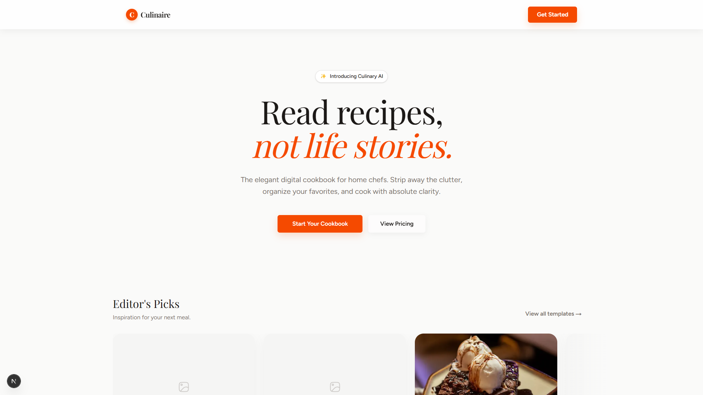

<div align="center">
<a href="https://github.com/fahmirizalbudi/reciper" target="blank">

</a>
<br/>

<br />
<br />


</div>

<br />

## Culinaire

Culinaire is a modern SaaS recipe application. It features a stunning "Ethereal SaaS 2026" aesthetic with pure white backgrounds, zero borders, volumetric shadows, and perfectly spaced typography. It allows users to read recipes without the distraction of life stories.

Key features include:

## Preview



## Features

- **Blazing Fast:** Powered by Next.js App Router for instant loading and SEO optimization.
- **Modern UI/UX:** An elegant, borderless aesthetic utilizing `Playfair Display` and `Figtree` typography, combined with smooth hovering shadows.
- **Distraction-Free:** Focus purely on the ingredients and steps without ads or popups.
- **Smart Scaling:** Seamlessly scale your ingredients with zero manual math.
- **Interactive Carousel:** Fluid recipe discovery using Embla Carousel.

## Tech Stack

- **Next.js (App Router)**: The React Framework for the Web.
- **Tailwind CSS v4**: A utility-first CSS framework for rapid UI development.
- **HugeIcons React**: A massive, premium icon set to maintain visual consistency.
- **Embla Carousel**: A lightweight carousel library with fluid physics.

## Getting Started

To get a local copy of this project up and running, follow these steps.

### Prerequisites

- **Node.js** & **NPM** (or **pnpm** / **Yarn**).

## Installation

1. **Clone the repository:**

   ```bash
   git clone https://github.com/fahmirizalbudi/reciper.git
   cd reciper
   ```

2. **Install dependencies:**

   ```bash
   npm install
   ```

3. **Start the development server:**

   ```bash
   npm run dev
   ```

## Usage

### Running the Application

- **Development mode:** `npm run dev`.
- **Production mode:** `npm run build` followed by `npm start`.

> Open [http://localhost:3000](http://localhost:3000) to view it in the browser.

## License

All rights reserved. This project is for educational purposes only and cannot be used or distributed without permission.
